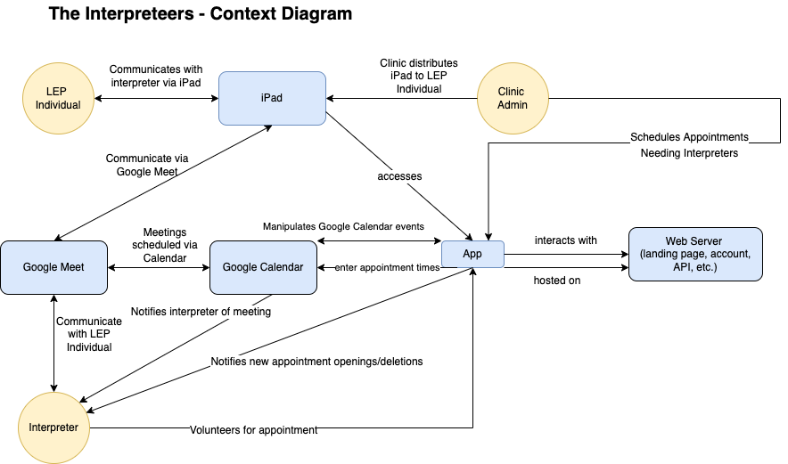

# Vocalize Columbus

## Welcome
A web app by using Typescript, Angular, Google API, and Ionic to make it easier for clinics and interpreters to connect so they can serve local community members who may encounter language barriers in a medical environment.

## App Structure

[App Structure](https://sharing.clickup.com/25788593/mm/h/rk05h-45/d66c62db7c856fd)

## Workspace Set Up
### Google Account
Find the email you have gotten that includes your temporary password.

Log into Google from anywhere:
- Username: \[first name][last name]@vocalizecolumbus.org (e.g. Ian Thompson => ianthompson@vocalizecolumbus.org)
- Password: temporary password

Change your password to a new password.

[Optional] Add your phone number or backup email for password recovery.

### Trello
If you do not have an account, create one (and feel free to use VC email)
Contact a VC administrator with your username, and you will be added to the Development board

### GitHub
If you do not have an account, create one (and feel free to use VC email)
Contact a VC administrator with your username, and you will be added to the GitHub repository

### Frontend Dev Environment
#### Install [VS Code](https://code.visualstudio.com/download)
Follow the instructions for installation - nothing fancy should be necessary.

#### Install [NodeJS](https://nodejs.org/en/download/)
Run through the setup wizard - no special setup required. Instructions: [Windows](https://docs.microsoft.com/en-us/windows/dev-environment/javascript/nodejs-on-windows)

#### Install Dependencies
In VS Code command line: `npm install`

#### Serve the Application
In VS Code command line: `ionic serve`

In browser: go to http://localhost:8100 (or whatever port ionic says it is hosted on)

### Backend Dev Environment
The backend scripts are hosted on [Google Apps Script](https://script.google.com/home/projects/1iEZktrzhicDaF57PdMwxuAvaWmGHWlXp0ukCKFEfBuXIv6b4CIhgtulE/edit). There is no setup required.

Used for:
- Generating leaderboard
- Generating volunteer time statistics for the main site

## Deploy Application to Production

### 1) Build the production app
In VS Code command line: `ionic build --prod` to build the app

### 2) Install [Firebase CLI](https://firebase.google.com/docs/cli) if not already installed
In VS Code command line: `npm install -g firebase-tools`

### 3) Deploy to Firebase ([Documentation](https://firebase.google.com/docs/cli#deployment))
`firebase deploy -m "Deploying the best new feature ever."`

## Documentation

Code is documented using the [TypeDoc](https://typedoc.org/guides/overview/) format.

To generate documentation in HTML, run `npx typedoc`. Settings for TypeDoc can be found in [typedoc.json](./typedoc.json). You should run this any time you make changes to ensure the documentation is up-to-date.

## Testing

### Unit Testing: Set up
1) After `npm install`, you have already installed all unit testing required services successfully.
2) To run unit tests, run `npm test` and a testing report will be generated by an automated browser.

### Unit Testing: Edit and test a specific component/file
1) To edit a specific unit testing script/file, head to each component under ‘src/app’ folder, add, modify, or delete at ‘xxxx.spec.ts’. (e.x. ‘calendar.service.spec.ts’)	
2) To run a specific unit testing script/file, head to ‘test.ts’ file under ‘src’ folder:
3) To run all tests, change the following line(Line 23) to (default): `const context = require.context('./', true, /\.spec\.ts$/);`
4) To run specific tests, change the following line(Line 23) to: `const context = require.context('./', true, /relative path for specific file\.spec\.ts$/);`
E.x.: const context = require.context('./', true, /calendar.service\.spec\.ts$/);

### E2E Testing Set up
1) Install Cypress: After `npm install`, you have already installed Cypress successfully.

2) To start Cypress: open terminals - run `ionic s` to start the server - run `npx cypress open` to start Cypress console (a browser will be opened, Chrome is prefered) - choose ‘E2E’ and ‘Chrome’.

### E2E: Test basic welcome page (no user signed in)
1) To run End to End testing: Under the ‘Specs’ tab, click the file you want to be tested(e.x. entry.cy.ts).
2) Click the ‘refreshing’ button to re-run the test.
3) Click the file name to edit the testing script.

### E2E: Test behaviors under different roles  (have user signed in)
Similar to the previous step, click ‘[role].cy.ts’ (e.x. clinicAdmin.cy.ts), but you have to stop the testing and have a clinic admin user sign in manually, then re-run the E2E testing. Remember to sign out after testing a specific role.

## Useful External Documentation
- [Typescript](https://www.typescriptlang.org/docs/)
- [Angular](https://angular.io/guide/architecture)
- [Ionic](https://ionicframework.com/docs/angular/overview)
- [Ionic UI Components](https://ionicframework.com/docs/components)
- [Cypress](https://www.cypress.io/)
- [Google Calendar API](https://developers.google.com/calendar/api/v3/reference)
- [Google Groups API](https://developers.google.com/admin-sdk/directory/reference/rest/v1/groups)

## Important Links
- [Vocalize Columbus Main Website](https://vocalizecolumbus.org/)
- [Vocalize Columbus Production Web App](https://app.vocalizecolumbus.org/home)
- [Google Cloud Console](https://console.cloud.google.com/apis/dashboard?project=vocalize-columbus) for managing/monitoring API usage.
- [Firebase Console](https://console.firebase.google.com/u/0/project/vocalize-columbus/overview) for deploying to production and database management.
- [Google Admin Console](https://admin.google.com/) for creating/deleting users.
- [Google Groups](https://groups.google.com/my-groups) for user role management.
